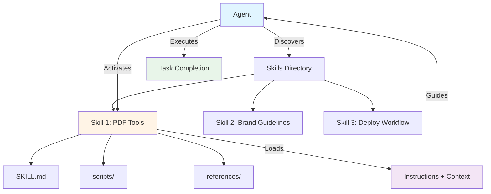
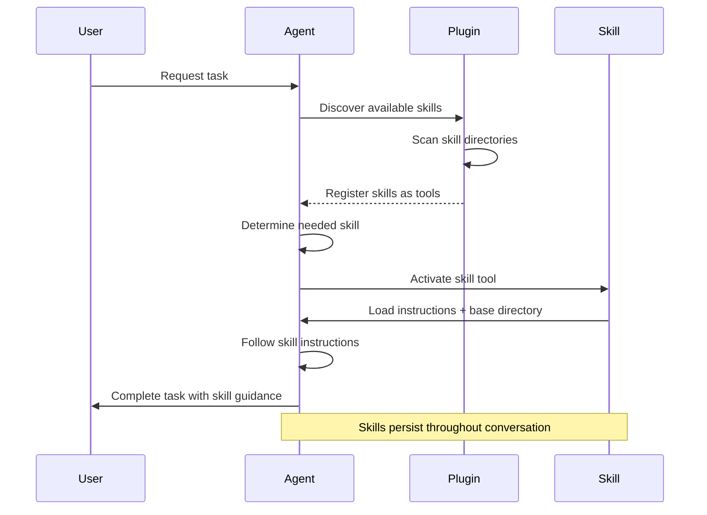
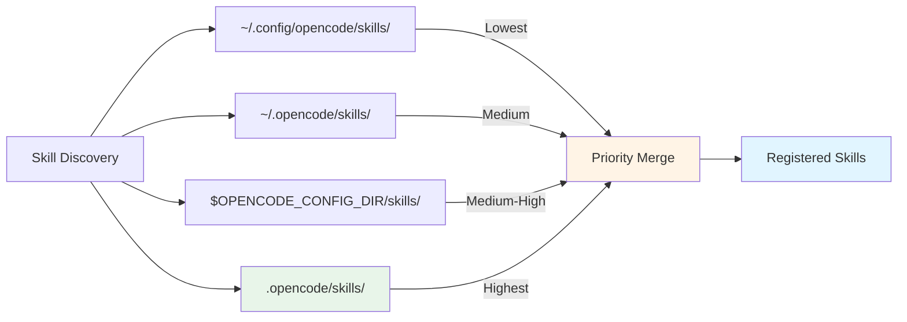
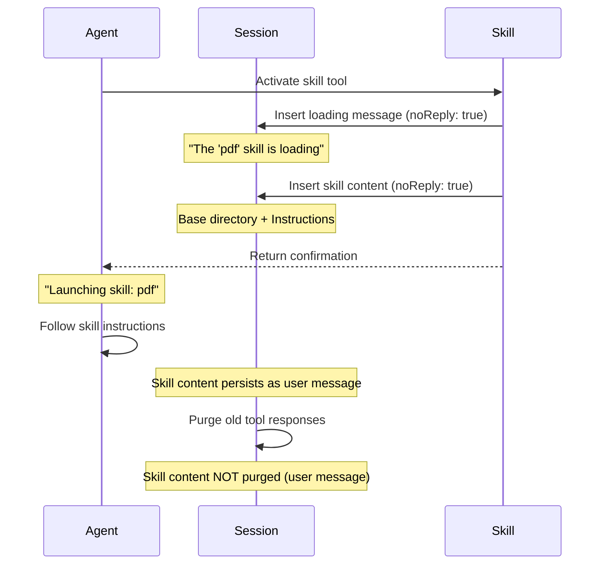
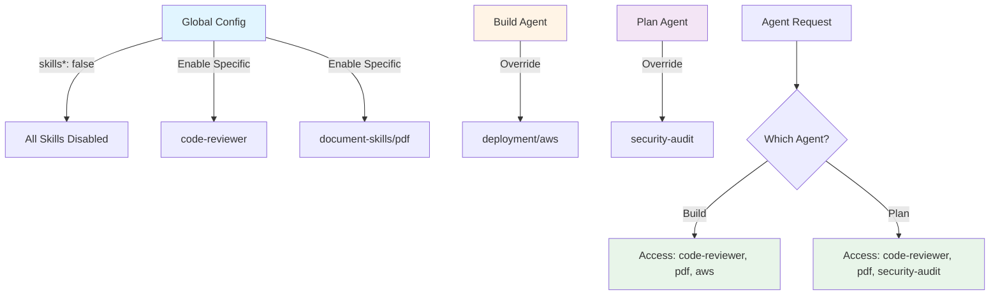
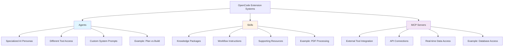

# Skills: Teaching Your AI New Tricks

Imagine if you could hand your AI assistant a manual for any task—a step-by-step guide for creating branded presentations, a playbook for analyzing financial data, or a workflow for deploying infrastructure. That's exactly what skills do in OpenCode.

Skills are packages of instructions, scripts, and resources that agents can load on demand to perform specialized tasks with precision and consistency. They're the difference between asking an AI to "figure it out" and giving it expert-level guidance.

## What Are Skills?

Skills are folders containing a `SKILL.md` file with instructions, plus any supporting files the agent might need—scripts, templates, reference documents, or configuration files. When an agent activates a skill, it receives all this context and follows the instructions to complete tasks accurately.

Think of skills as:

- **Domain expertise packages** - Legal review processes, data analysis pipelines, security audits
- **Workflow automation** - Multi-step tasks turned into consistent, repeatable procedures
- **Capability extensions** - New abilities like PDF manipulation, presentation creation, or form filling
- **Organizational knowledge** - Company-specific guidelines, brand standards, or coding conventions



## The Agent Skills Standard

Skills in OpenCode follow the [Agent Skills specification](https://agentskills.io), an open standard originally developed by Anthropic and adopted by leading AI development tools including OpenCode, Cursor, Claude, GitHub Copilot, and VS Code.

This means:

- **Write once, use everywhere** - Skills you create work across multiple AI tools
- **Interoperability** - Share skills across your team and the broader ecosystem
- **Future-proof** - Built on an open standard that evolves with community input
- **Growing ecosystem** - Access skills from [anthropics/skills](https://github.com/anthropics/skills) and other sources

## Anatomy of a Skill

Every skill has a simple structure:

```
my-skill/
├── SKILL.md              # Required: Instructions and metadata
├── scripts/              # Optional: Executable code
│   └── helper.py
├── references/           # Optional: Documentation
│   └── api-docs.md
└── assets/               # Optional: Templates and resources
    └── template.html
```

### The SKILL.md File

The heart of every skill is its `SKILL.md` file with YAML frontmatter:

```markdown
---
name: brand-guidelines
description: Ensures all content follows company brand standards including colors, fonts, tone, and messaging
license: MIT
---

# Brand Guidelines Skill

This skill helps maintain consistent branding across all company materials.

## Brand Colors

- Primary: #0066CC (Corporate Blue)
- Secondary: #FF6B35 (Accent Orange)
- Neutral: #F5F5F5 (Background Gray)

## Typography

- Headings: Montserrat Bold
- Body: Open Sans Regular
- Code: Fira Code

## Tone of Voice

- Professional but approachable
- Clear and concise
- Action-oriented

## Instructions

When creating any content:

1. Use brand colors from the palette above
2. Apply correct typography hierarchy
3. Match the established tone of voice
4. Reference `references/style-guide.pdf` for detailed guidelines
```

The frontmatter requires:

- **name** - Unique identifier (lowercase with hyphens)
- **description** - Clear explanation of what the skill does (minimum 20 characters)
- **license** - Optional licensing information

## How Skills Work in OpenCode

OpenCode implements skills through the [opencode-skills](https://github.com/malhashemi/opencode-skills) plugin, which automatically discovers and registers skills as dynamic tools.



### Discovery and Priority

The plugin scans multiple locations for skills, with a clear priority order:

1. **`~/.config/opencode/skills/`** - XDG config location (lowest priority)
2. **`~/.opencode/skills/`** - Global skills for all projects
3. **`$OPENCODE_CONFIG_DIR/skills/`** - Custom config directory (if set)
4. **`.opencode/skills/`** - Project-local skills (highest priority)

When duplicate skill names exist, the project-local version takes precedence. This allows you to:

- Share global skills across all projects
- Override global skills with project-specific versions
- Maintain team-wide skills in version control



### Tool Naming Convention

Skills are automatically registered as tools with a consistent naming pattern:

| Directory Path         | Skill Name         | Tool Name                    |
| ---------------------- | ------------------ | ---------------------------- |
| `brand-guidelines/`    | `brand-guidelines` | `skills_brand_guidelines`    |
| `document-skills/pdf/` | `pdf`              | `skills_document_skills_pdf` |
| `tools/analyzer/`      | `analyzer`         | `skills_tools_analyzer`      |

The tool name is generated from the directory path, with:

- Prefix: `skills_`
- Path components joined with underscores
- Hyphens converted to underscores

### Message Insertion Pattern

OpenCode uses a sophisticated message insertion pattern to deliver skill content that persists throughout long conversations:



This pattern ensures:

- **Persistence** - Skill content remains available throughout the conversation
- **Context preservation** - Even when tool responses are purged to manage context
- **Agent continuity** - The agent always has access to skill instructions

### Skill Access Control

Control which agents can access which skills using OpenCode's tool configuration:

```json
{
  "$schema": "https://opencode.ai/config.json",
  "tools": {
    "skills*": false,
    "skills_code_reviewer": true,
    "skills_document_skills_pdf": true
  },
  "agent": {
    "build": {
      "tools": {
        "skills_deployment_aws": true
      }
    },
    "plan": {
      "tools": {
        "skills_security_audit": true
      }
    }
  }
}
```

This configuration:

- Disables all skills by default (`skills*: false`)
- Enables specific skills globally
- Grants the `build` agent access to deployment skills
- Grants the `plan` agent access to security audit skills



## The Skills Ecosystem

Browse and contribute skills:

- [anthropics/skills](https://github.com/anthropics/skills) - Official skill examples
- [agentskills.io](https://agentskills.io) - Skills specification and documentation
- [opencode-skills](https://github.com/malhashemi/opencode-skills) - OpenCode implementation

## Skills vs. Agents vs. MCP

OpenCode provides three complementary systems for extending AI capabilities:



**When to Use Each:**

**Agents** - Different AI personalities with different capabilities

- Switch between planning and building modes
- Create specialized agents (security auditor, code reviewer)
- Control tool access per agent

**Skills** - Teach agents how to do specific tasks

- Package domain expertise (legal, financial, technical)
- Standardize workflows across your team
- Provide step-by-step guidance

**MCP Servers** - Connect to external systems and data

- Access databases, APIs, or cloud services
- Integrate third-party tools
- Fetch real-time information

**Example Workflow:**

1. **Agent** (Build) - Has access to file operations and skills
2. **Skill** (PDF Processing) - Provides instructions for PDF manipulation
3. **MCP Server** (Cloud Storage) - Fetches PDF files from S3

## Why Skills Matter

Skills transform AI agents from general-purpose assistants into specialized experts. They enable:

**Consistency** - Everyone follows the same procedures, reducing errors and variations

**Knowledge Capture** - Organizational expertise becomes portable, version-controlled packages

**Onboarding** - New team members get instant access to established workflows

**Compliance** - Ensure regulatory requirements are followed systematically

**Efficiency** - Agents perform complex tasks correctly the first time

**Interoperability** - Skills work across multiple AI tools (OpenCode, Cursor, Claude, etc.)

The Agent Skills standard is growing rapidly, with adoption from major AI platforms and a thriving ecosystem of community-contributed skills. By creating skills, you're not just improving your own workflows—you're contributing to a shared knowledge base that benefits the entire AI development community.

---

_Ready to create your first skill? Start with the [template-skill](https://github.com/anthropics/skills/tree/main/template) and explore [example skills](https://github.com/anthropics/skills/tree/main/skills) for inspiration. Visit [agentskills.io](https://agentskills.io) for the complete specification._
